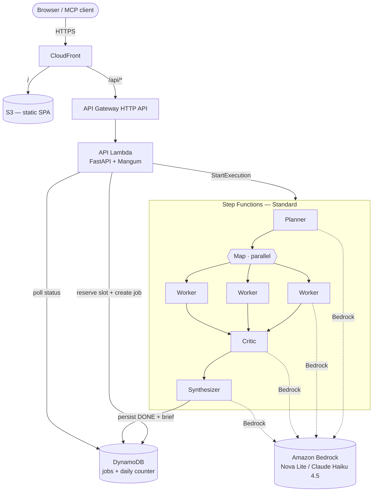

<h1 align="center">scout</h1>

<p align="center">
  <em>Ask a question. Five AI agents research it in parallel on AWS and hand you back a cited brief —<br/>
  running on the AWS free tier, deployed with one command.</em>
</p>

<p align="center">
  
  
  
  
  
  
  
</p>

<p align="center">
  <a href="#run-the-demo-locally--no-aws-0"><b>▶ Run the demo locally (no AWS, $0)</b></a> &nbsp;·&nbsp;
  <a href="docs/sample-brief.md"><b>📄 Sample brief</b></a>
</p>

<!-- TODO after deploy: add the CloudFront URL and a docs/demo.gif above -->

---

**scout** is a serverless, multi-agent research pipeline. You submit a topic; an orchestrator
fans out to several Amazon Bedrock–powered agents — a planner, parallel research workers, a
critic, and a synthesizer — which together return a structured, source-attributed markdown brief.

It's also exposed as an **[MCP server](#mcp-server)**, so any Model Context Protocol client
(Claude Desktop, IDEs) can call `research(topic)` as a tool. Same AWS backend, two front doors.

## Architecture



Each box is a real, independently-deployed Lambda. The fan-out is genuine (a Step Functions
`Map` state runs the workers in parallel), and the orchestration is visible as an execution
graph in the AWS console — see `docs/`.

## What this demonstrates

| Skill | Where to see it |
|---|---|
| **Serverless** | Everything scales to zero — Lambda, API Gateway, Step Functions, DynamoDB on-demand |
| **Infrastructure as Code** | The entire stack is one [`template.yaml`](template.yaml) (AWS SAM) |
| **Multi-agent orchestration** | [`pipeline.asl.json`](src/statemachine/pipeline.asl.json) — plan → parallel research → verify → synthesize |
| **GenAI / Amazon Bedrock** | [`core/bedrock.py`](src/core/bedrock.py) — Converse API, one-flag model swap (Nova ↔ Claude) |
| **Event-driven / async** | Job-id submit + polling; Step Functions service integrations write status to DynamoDB |
| **CI/CD** | [`.github/workflows`](.github/workflows) — lint + tests on PR, **keyless OIDC deploy** on merge |
| **Cost engineering** | Per-run token caps, daily run cap, low API throttle — designed for **~$0/month** |
| **Testing** | 20 tests, [`pytest` + `moto`](tests/) — the suite runs offline with no AWS calls |
| **Runs with zero setup** | `python demo.py` runs the full pipeline offline (stub model + in-memory store) — no AWS, no cost |
| **MCP** | [`mcp/`](mcp/) — the pipeline re-exposed as a Model Context Protocol tool |

## 💸 Cost — built to stay on the free tier

Only **Amazon Bedrock** has no free tier; everything else sits inside AWS's *Always Free* or
12-month allowances. With the default **Amazon Nova Lite** model:

| Usage | Approx. Bedrock cost |
|---|---|
| 1 research run (~6 model calls) | **~US$0.003** |
| 100 runs / month | **~US$0.33** |
| Idle | **US$0.00** (scales to zero) |

Guardrails keep it there: a hard per-run token ceiling, a configurable **daily run cap**
(default 100), low API Gateway throttling, and DynamoDB TTL cleanup. Set an **AWS Budgets**
alarm before first use. Tear it all down with `sam delete`.

> ⚠️ Bedrock model access must be enabled per-model in the console (region `us-east-1`) before
> the first call. "Quality mode" uses Claude Haiku 4.5 (~16× Nova's token price, still cents).

## Quickstart

### Run the demo locally — no AWS, $0

The fastest way to see scout work. `SCOUT_OFFLINE` swaps Bedrock for a deterministic in-process
stub and DynamoDB for an in-memory store, so the **entire five-agent pipeline runs on your
laptop with no AWS account, no credentials, and no cost** — then serves the SPA and API together:

```bash
python -m venv .venv && . .venv/Scripts/activate   # Windows (use bin/activate on macOS/Linux)
pip install -r requirements-dev.txt
python demo.py                                      # -> http://127.0.0.1:8000
```

Open the page, submit a topic, and watch the planner → workers → critic → synthesizer hand back
a cited brief (see [`docs/sample-brief.md`](docs/sample-brief.md) for example output). The stub
produces realistic *shape*, not verified facts — it exists so the pipeline, API, and UI are
fully exercisable offline. Swap in real Bedrock by deploying (below) or unsetting `SCOUT_OFFLINE`
with AWS credentials configured.

```bash
pytest -q                                           # 20 tests, fully offline
```

### Run against real Bedrock (local)

```bash
uvicorn api.app:app --app-dir src --reload          # http://localhost:8000/docs
```

With no `STATE_MACHINE_ARN` set, `POST /jobs` runs the whole pipeline in-process and returns the
brief directly. Real Bedrock calls need AWS credentials + per-model access enabled in `us-east-1`.

### Deploy to AWS

```bash
sam build
sam deploy --guided          # first time; afterwards just `sam deploy`
```

Requires the [AWS SAM CLI](https://docs.aws.amazon.com/serverless-application-model/latest/developerguide/install-sam-cli.html).
Outputs the API URL. Point the SPA in [`frontend/`](frontend/) at it (or front both with CloudFront).

## How the agents work

1. **Planner** decomposes the topic into focused, non-overlapping sub-questions.
2. **Workers** (parallel `Map`) each research one sub-question and report findings with confidence.
3. **Critic** reviews the findings, softens unsupported claims, and adjusts confidence.
4. **Synthesizer** merges everything into a cited markdown brief and persists the finished job.

Prompts live in [`core/prompts.py`](src/core/prompts.py) so the system's reasoning is auditable
at a glance.

> **On citations (v1):** sources are *model-attributed* (the kind of source a reader could
> verify), not yet retrieval-verified. Grounding each claim in a real fetched source is the
> Phase 6 RAG upgrade on the roadmap — kept free-tier-safe with embeddings stored in DynamoDB.

## MCP server

```bash
cd mcp && npm install
SCOUT_API_BASE="https://<your-api>.execute-api.us-east-1.amazonaws.com" npx scout-mcp
```

Exposes a single `research(topic, quality?)` tool over stdio. Add it to any MCP client to get
cited briefs without leaving your editor.

## CI/CD — keyless deploys

`deploy.yml` assumes an AWS IAM role via **GitHub OIDC** — no long-lived access keys live in
the repo, only a role ARN that is useless without the trust policy scoped to this repository.
One-time setup: create an IAM OIDC provider for `token.actions.githubusercontent.com` and a
least-privilege deploy role whose trust policy pins `repo:Ewertonslv/scout:ref:refs/heads/main`,
then store its ARN as the `AWS_DEPLOY_ROLE_ARN` secret.

## Project layout

```
scout/
├── demo.py                    # one-command offline demo (no AWS, $0)
├── template.yaml              # SAM — all infrastructure
├── src/
│   ├── api/                   # FastAPI + Mangum (submit, status)
│   ├── agents/                # planner, worker, critic, synthesizer Lambdas
│   ├── core/                  # bedrock, budget, repo, models, prompts, pipeline
│   └── statemachine/          # pipeline.asl.json (the orchestration)
├── frontend/                  # single-file demo SPA
├── mcp/                       # MCP server wrapper (Node)
├── tests/                     # pytest + moto (offline)
└── .github/workflows/         # ci.yml, deploy.yml (OIDC)
```

## Roadmap

- [x] Phases 0–2 — agents, orchestration, async job API, tests
- [x] Offline demo — full pipeline runs on a laptop with no AWS (`python demo.py`)
- [ ] Phase 3 — host the SPA on S3 + CloudFront; record the demo GIF
- [ ] Phase 4 — wire the OIDC deploy role; first live deploy
- [ ] Phase 5 — Budgets alarm, observability dashboard screenshot
- [ ] Phase 6 — retrieval-grounded citations (DynamoDB vector store) + publish `scout-mcp` to npm

## License

MIT © Ewerton Silva
